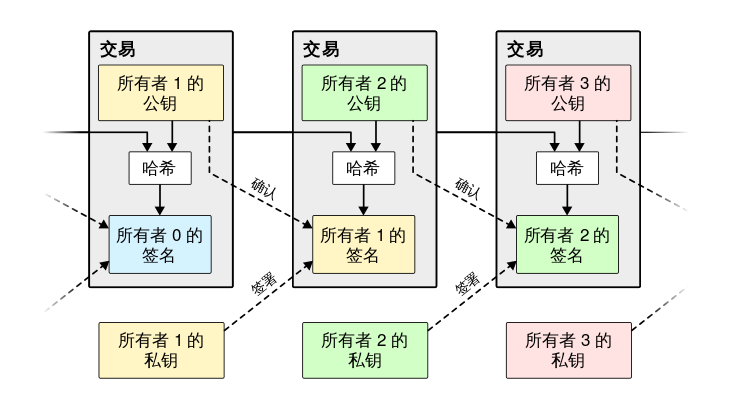

# 2.1 交易（Transactions）—— 电子货币的定义

## 原文与翻译

We define an electronic coin as a chain of digital signatures. Each owner transfers the coin to the next by digitally signing a hash of the previous transaction and the public key of the next owner and adding these to the end of the coin. A payee can verify the signatures to verify the chain of ownership.

我们将一枚电子硬币定义为一个数字签名链。一位所有者将一枚硬币交给另一个人的时候，要通过在这个数字签名链的末尾附加上以下数字签名：上一笔交易的哈希（hash，音译，亦翻译为“散列值”），以及新所有者的公钥。收款人可以通过验证签名去验证数字签名链的所属权。



## 重要概念解析

- **哈希（Hash）：** 指将一串任意长度的数据通过「哈希函数」（Hash Function）转换出的「固定长度的字符串」，等同于这串数据的「唯一签名」。

  通过原始数据可以校验 hash ，也即可以判断签名真实性；但不能通过 hash 还原数据，也即是「不可逆」的。

【Python 知识点】点击链接跳转至《自学是门手艺》相应知识点
- [值](https://github.com/selfteaching/the-craft-of-selfteaching/blob/master/Part.1.E.2.values-and-their-operators.ipynb)
- [函数](https://github.com/selfteaching/the-craft-of-selfteaching/blob/master/Part.1.E.4.functions.ipynb)
- [字符串](https://github.com/selfteaching/the-craft-of-selfteaching/blob/master/Part.1.E.5.strings.ipynb)


```python
# 试试自己生成 hash
# -*- encoding: utf-8 -*-
import random

hash = random.getrandbits(256) # md5 哈希算法

print("hash value by md5: %032x" % hash)

import hashlib

str_a = "shatoshi" # sha256 算法，bitcoin所使用的哈希算法之一

print("hash value by sha256: %s" % hashlib.sha256().hexdigest())
```

    hash value by md5: f4c2070b6d8f71252a44bcbd292d8deb7c695550aa582fb9cda4247df0eccf65
    hash value by sha256: e3b0c44298fc1c149afbf4c8996fb92427ae41e4649b934ca495991b7852b855


- **公钥和私钥（Public Key and Private Key)：** 两把相互配套的「数字钥匙」，可用来「加密解密」或「签名验证」。一般来说，公钥是公开的，私钥是所有者保密的。

  既然是加密，那肯定是不希望别人知道我的消息，所以只有我才能解密，所以可得出公钥负责加密，私钥负责解密；同理，既然是签名，那肯定是不希望有人冒充我发消息，只有我才能发布这个签名，所以可得出私钥负责签名，公钥负责验证（本段来自知乎回答：[RSA的公钥和私钥到底哪个才是用来加密和哪个用来解密？](https://www.zhihu.com/question/25912483/answer/46649199)）。

## ↓↓↓以下内容为进阶知识 入门可略过↓↓↓

## ECDSA 与 Secp256k1

我们在看比特币加密算法相关的时候会看到 ECDSA 和 Secp256k1 这两个概念，那么这两个又是啥呢？

- [**ECDSA**](https://en.bitcoin.it/wiki/Elliptic_Curve_Digital_Signature_Algorithm)

  Elliptic Curve Digital Signature Algorithm or ECDSA is a cryptographic algorithm used by Bitcoin to ensure that funds can only be spent by their rightful owners.
  
  椭圆曲线数字签名算法（ECDSA）是一种比特币使用的密码学算法，该算法可确保资产只能被它们合法的拥有者所使用。
  
  私钥、公钥和签名是与 ECDSA 相关的三个重要概念。私钥和公钥的概念刚才已经说过了。现在再说说「签名」这个概念。
  
  **签名（Signature）：** 一个可以证明「签名行为」发生过的数字/哈希。这个数字来源于一串哈希和私钥的数学运算。和公私钥不同，签名不是定长的，一般长度为 73、72 或 71 个字节。
  
- [**Secp256k1**](https://en.bitcoin.it/wiki/Secp256k1)
  
  Secp256k1 是比特币所使用的**椭圆曲线的参数**。所以，如果在一篇文章中提到 Secp256k1 签名算法，则可以理解为「使用了 Secp256k1 参数的 ECDSA 算法」。
  

下面，将用 Python 版本的 ECDSA 库来演示 Secp256k1 的签名 / 验证过程。 


```python
# 试试用Secp256k1 加解密
# -*- encoding: utf-8 -*-
import binascii
from ecdsa import SigningKey
from ecdsa.curves import SECP256k1

# 生成签名钥（私钥）、验证钥（前面加上<<04>>即是公钥）与签名
signning_key = SigningKey.generate(curve=SECP256k1)
verifing_key = signning_key.get_verifying_key()
signature = signning_key.sign(b'shatoshi')

sk_hex = binascii.hexlify(signning_key.to_string()).decode('utf-8')
vk_hex = binascii.hexlify(verifing_key.to_string()).decode('utf-8')
sig_hex = binascii.hexlify(signature).decode('utf-8')

print("sk hex is {0}, len is {1}".format(sk_hex,len(sk_hex))) # 32 字节的 binary，转换成 16 进制的话字符串长度是 64
print("vk hex is {0}, len is {1}".format(vk_hex,len(vk_hex))) # 64 字节的 binary，转换成 16 进制的话字符串长度是 128
print("sig hex is {0}, len is {1}".format(sig_hex,len(sig_hex)))

# 验证钥验证签名
print(verifing_key.verify(signature, b'shatoshi'))
verifing_key.verify(signature, b'batoshi') # 错误的签名导致错误抛出
```

    sk hex is 2de61f4440cb795a80fdfd4959001e95df3874f858e51e9a26fa8d5a362bbb82, len is 64
    vk hex is f1b3ffe40966091c2571652aba93924be80860680e569e8ee5d712c42b96ee9b79369f3c7a2e80aa68e52acde73a42b8bf341cb5a1b8a1ca441fe7aca3a3578a, len is 128
    sig hex is dfe7cf7103a3fbc8c4508f955888ff87c6307050055176a48d4714b7722e1d6c9ce39e5469ea1e493ad60061468057d4ca4483e6caa8833cc7703a9ace2f8232, len is 128
    True


    ---------------------------------------------------------------------------
    
    BadSignatureError                         Traceback (most recent call last)
    
    <ipython-input-2-85fbbe802489> in <module>
         20 # 验证钥验证签名
         21 print(verifing_key.verify(signature, b'shatoshi'))
    ---> 22 verifing_key.verify(signature, b'batoshi') # 错误的签名导致错误抛出


    /usr/local/lib/python3.7/site-packages/ecdsa/keys.py in verify(self, signature, data, hashfunc, sigdecode)
         99         hashfunc = hashfunc or self.default_hashfunc
        100         digest = hashfunc(data).digest()
    --> 101         return self.verify_digest(signature, digest, sigdecode)
        102 
        103     def verify_digest(self, signature, digest, sigdecode=sigdecode_string):


    /usr/local/lib/python3.7/site-packages/ecdsa/keys.py in verify_digest(self, signature, digest, sigdecode)
        111         if self.pubkey.verifies(number, sig):
        112             return True
    --> 113         raise BadSignatureError
        114 
        115 class SigningKey:


    BadSignatureError: 


## Secp256k1 与 公私钥 的关系

- **私钥的本质：** 私钥的本质是一个数字，这个数字用 16 进制表示的话，长度是 64；转换为字节，是 32 字节（关于 16 进制与字节的补充知识请看这里 :TODO）。
- **公钥的本质：** 用私钥生成Secp256k1曲线上的一个点，将 x 与 y 拼接起来，再在开头加上 <<04>> 后得到一个数字，这个数字就是公钥。用 16进制表示的话，长度是 130；转换为字节，是 65 字节。

## 公钥、私钥与地址的多种形式
虽然公钥、私钥的本质是数字，但是，不同编码方式下，公钥、私钥，还有公钥生成的地址，可以以多种形式呈现。通过这个[古老的比特币地址生成网站](https://www.bitaddress.org/bitaddress.org-v3.3.0-SHA256-dec17c07685e1870960903d8f58090475b25af946fe95a734f88408cef4aa194.html)，我们可以了解到有哪些形式：
- **私钥**
    - Private key 普通私钥（通过整型、16进制 或者 字节表示）
    - Private key WIF( Wallet Import Format) 
    - Private Key WIF Compressed
- **公钥**
    - Public Key 普通公钥（通过整型、16进制 或者 字节表示）
    - Public Key Compressed 压缩的公钥
    
      【参考】https://bitcoin.stackexchange.com/questions/3059/what-is-a-compressed-bitcoin-key
    
- **地址**
    - Bitcoin Address 普通比特币地址，通过 Public Key 生成
    - Bitcoin Address Compressed 压缩的比特币地址，通过  Public Key Compressed 生成
    

通过私钥我们可以生成公钥，通过公钥我们可以生成地址，但这两个过程均是不可逆的：


(本图来自精通比特币4.1.2：http://v1.8btc.com/books/261/master_bitcoin/_book/4/4.html）

## 交易类型、Output 与 UTXO

若要理解 UTXO，先要理解 Output；若要理解 Output，先要知道比特币的交易类型。

- **比特币的交易类型：** 比特币的交易有 [**P2PKH、P2PK、P2SH、P2WPKH**](https://bitcoin.stackexchange.com/questions/64733/what-is-p2pk-p2pkh-p2sh-p2wpkh-eli5) 四种类型。我们目前先讲 P2SH 和 P2PKH。
    - P2SH（TODO）
    - P2PKH
        - **PKH：** 公钥哈希（Public Key Hash），公钥经过 Sha256 函数加密，再经过 Ripemd160 函数加密，就得到了公钥哈希。公钥函数在开头加上地址版本（Address Version），再经过 Base58Check 函数加密，就会得到比特币地址。
    
            需要注意的是，Sha256 和 Ripemd160 是**单向函数**，因此可以通过公钥生成公钥哈希，但无法通过公钥哈希还原出公钥；Base58Check 是**双向函数**，因此可以通过地址得到公钥哈希。
        
        - **P2PKH：** 面向公钥哈希支付，交易需要发送人（sender）提供来自私钥的有效签名与公钥，交易输出脚本（Transaction Output Script）会使用[签名和公钥来验证签名是否与公钥哈希匹配](https://en.bitcoin.it/wiki/Transaction#Output)。如果匹配，则这笔钱会被支付出去。
    
- **Output：** 知道以上概念，我们就能把握 Output 的含义：
    Output 包含两个部分 —— 一个表明表示这个 Output 里有多少比特币的数字与一个公钥脚本。打个比方，就是一个蓄水池与一个水龙头，水龙头需要用一把钥匙打开（签名脚本）。如果钥匙匹配，蓄水池打开，水就变成接收者的了。


←放水图

- **UTXO：** 知道了 Output，我们便能自然而然地理解 UTXO（Unspent Transaction Output）—— 公钥脚本还没「解锁」，还没放水的 Output。

> 在 Bitcoin 以及其他使用 UTXO 模型的加密货币中，某一个『账户』中的余额并不是由一个数字表示的，而是由当前区块链网络中所有跟当前『账户』有关的 UTXO 组成的。
> 
> 上图中所有绿色的交易输出才是 UTXO，红色的交易输出已经被当前『账户』使用了，所以在计算当前账户的余额时只会考虑绿色的交易输出，也就是 UTXO。
>
> —— [Draveness](https://draveness.me/utxo-account-models)

【延伸阅读】

[UTXO 与账户余额模型](https://draveness.me/utxo-account-models)

## 总结

实际上，区块链系统中有「两条链」。一个个区块头尾相连形成的链是显式的，也即使「Block Chain」；另一条是由「Output」组成的链，这些链的起始是「币基交易（Coinbase Transaction)」，终点则是 UTXO。

把握了第二条链，我们便知道了比特币系统中的资金是如何流动的。
