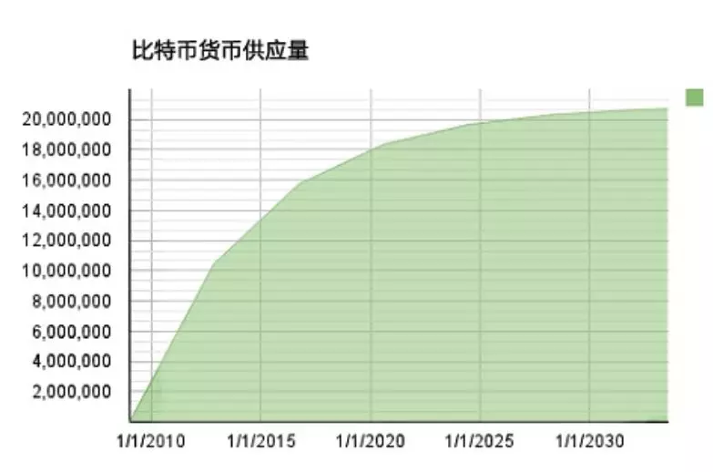

# 6 激励（Incentive）

## 原文与翻译

By convention, the first transaction in a block is a special transaction that starts a new coin owned by the creator of the block. This adds an incentive for nodes to support the network, and provides a way to initially distribute coins into circulation, since there is no central authority to issue them. The steady addition of a constant of amount of new coins is analogous to gold miners expending resources to add gold to circulation. In our case, it is CPU time and electricity that is expended.

按照约定，每个区块的第一笔交易是一个特殊的交易，它会生成一枚新的硬币，所属权是这个区块的生成者。这么做，使得节点支持网络有所奖励，也提供了一种将硬币发行到流通之中的方式 —— 在这个系统中，反正也没有一个中心化的权威方去发行那些硬币。如此这般稳定地增加一定数量的新硬币进入流通，就好像是黄金开采者不断耗用他们的资源往流通之中增加黄金一样。在我们的系统中，被耗用的资源是 CPU 工作时间和它们所用的电力。

The incentive can also be funded with transaction fees. If the output value of a transaction is less than its input value, the difference is a transaction fee that is added to the incentive value of the block containing the transaction. Once a predetermined number of coins have entered circulation, the incentive can transition entirely to transaction fees and be completely inflation free.

奖励还可以来自交易费用。如果一笔交易的输出值小于它的输入值，那么其中的差额就是交易费；而该交易费就是用来奖励节点把该交易打包进此区块的。一旦既定数量的硬币已经进入流通，那么奖励将全面交由交易手续费来完成，且绝对不会有通货膨胀。

The incentive may help encourage nodes to stay honest. If a greedy attacker is able to assemble more CPU power than all the honest nodes, he would have to choose between using it to defraud people by stealing back his payments, or using it to generate new coins. He ought to find it more profitable to play by the rules, such rules that favour him with more new coins than everyone else combined, than to undermine the system and the validity of his own wealth.

奖励机制也可能会鼓励节点保持诚实。如果一个贪婪的攻击者能够网罗比所有诚实节点都更多的 CPU 算力，他必须做出一个选择：是用这些算力通过把自己花出去的钱偷回来去欺骗别人呢？还是用这些算力去生成新的硬币？他应该能够发现按照规则行事是更划算的，当前规则使得他能够获得比所有其他人加起来都更多的硬币，这显然比暗中摧毁系统并使自己的财富化为虚无更划算。

## 什么是挖矿？

挖矿是「通过寻找 Nonce 以获得区块的打包权」。
找到 Nonce，打包了区块后，程序通过造币交易（Coinbase Transaction）生成某个数额的比特币，这些「新币」和交易费作为奖励发给「矿工」。

>「挖矿」这个词有一定的误导性。它容易引起对贵重金属采矿的联想，从而使我们的注意力都集中在每个新区快产生的奖励上。尽管挖矿带来的奖励是一种激励，但它最主要的目的并不是奖励本身或者新币的产生。如果只把挖矿看作生产新币的过程，那你是把手段（激励措施）当成了目的。挖矿是一种将结算所去中心化的过程，每个结算所对处理的交易进行验证和结算。**挖矿保护了比特币系统的安全，并且实现了在没有中心机构的情况下，也能使整个比特币网络达成共识。**
>
>                                                                     ——《精通比特币》

## 为什么比特币总数是2100万枚？

对「新币奖励」的过程有了正确的认知，我们就能明白为什么比特币总数是固定的2100万枚。这是比特币设定的机制决定的——最开始每「开采」一个区块奖励 50 个比特币。之后，每追加 210,000 个区块，货币发行速率降低 50% 。直到每区块发行比特币数量变为比特币的最小货币单位—— 1 聪，这时区块总量会到达 1344 万个，年份是 2140 年左右，彼时比特币的数量就是 2100 万左右了。

一个网站，能看到比特币下次减半是什么时候，以及其它一些有意思的数据——

https://www.bitcoinblockhalf.com/
