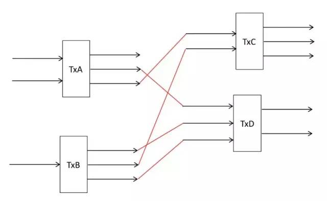
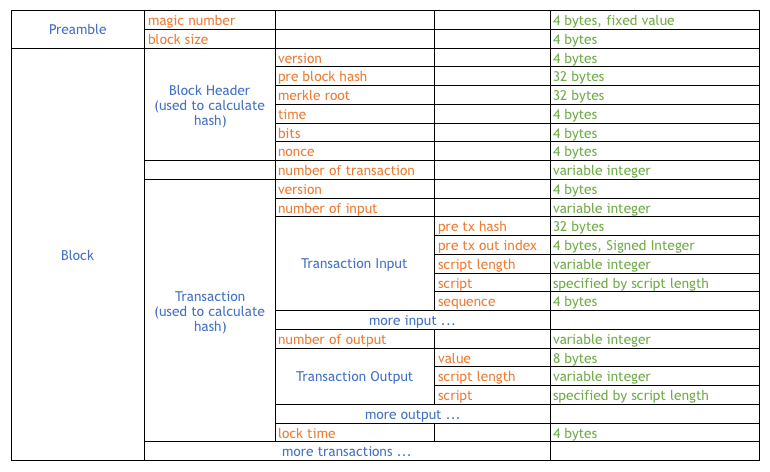

# 9 Combining and Splitting Value（值的组合与分割）

## 原文与翻译

Although it would be possible to handle coins individually, it would be unwieldy to make a separate transaction for every cent in a transfer. To allow value to be split and combined, transactions contain multiple inputs and outputs. Normally there will be either a single input from a larger previous transaction or multiple inputs combining smaller amounts, and at most two outputs: one for the payment, and one returning the change, if any, back to the sender.

尽管逐个地处理硬币是可能的，但为每分钱设置一个单独的记录是很笨拙的。为了允许值的分割与合并，交易记录包含多个输入和输出。一般情况下，要么是一个单独的来自于一个相对大的之前的交易的输入，要么是很多个输入来自于更小金额的组合；与此同时，最多有两个输出：一个是支付（指向收款方），如果必要的话，另外一个是找零（指向发款方）。


It should be noted that fan-out, where a transaction depends on several transactions, and those transactions depend on many more, is not a problem here. There is never the need to extract a complete standalone copy of a transaction's history.

值得注意的是，“扇出”在这里并不是问题 —— 所谓“扇出”，就是指一笔交易依赖于数笔交易，且这些交易又依赖于更多笔交易。从来就没有必要去提取任何一笔交易的完整独立的历史拷贝。

## 比特币的本质——历史记录不可篡改的账本

如果要向完全不了解区块链或者比特币的人用一句话介绍比特币，那么就是这一句——
比特币的本质是一本**「历史记录不可篡改的账本」**。

这个账本即由无数的上图所示的交易所组成。



值得注意的是，这个账本里没有传统银行系统所谓的「账户」。
- 要查一个地址的所有交易记录，那么只要检索所有的历史 Output，找出相关交易即可。
- 要发送一笔交易，那么只要在「UTXO 池」中找到 Output，用私钥构造交易即可。

## 通过 bitcoinlib 库实现比特币交易全过程

【Python 知识点】 点击链接跳转至《自学是门手艺》相应知识点
- [函数](https://github.com/selfteaching/the-craft-of-selfteaching/blob/master/Part.2.D.1-args.ipynb)


```python
import hashlib
from bitcoin import SelectParams
from bitcoin.core import b2x, lx, COIN, COutPoint, CMutableTxOut, CMutableTxIn, CMutableTransaction, Hash160
from bitcoin.core.script import CScript, OP_DUP, OP_HASH160, OP_EQUALVERIFY, OP_CHECKSIG, SignatureHash, SIGHASH_ALL
from bitcoin.core.scripteval import VerifyScript, SCRIPT_VERIFY_P2SH
from bitcoin.wallet import CBitcoinAddress, CBitcoinSecret
```


```python
# 通过私钥生成 p2sh 地址
h = hashlib.sha256(b'correct horse battery staple').digest()
secret_key = CBitcoinSecret.from_secret_bytes(h)
txin_redeemScript = CScript([secret_key.pub, OP_CHECKSIG])
txin_scriptPubKey = txin_redeemScript.to_p2sh_scriptPubKey()
txin_p2sh_address = CBitcoinAddress.from_scriptPubKey(txin_scriptPubKey)

print('Script Hash 地址:', str(txin_p2sh_address))
```

    Script Hash 地址: 323uf9MgLaSn9T7vDaK1cGAZ2qpvYUuqSp


```python
# 构造未签名交易
txid = lx('bff785da9f8169f49be92fa95e31f0890c385bfb1bd24d6b94d7900057c617ae')
vout = 0
txin = CMutableTxIn(COutPoint(txid, vout))
print("Transaction In: \n", txin)
txout = CMutableTxOut(10, CBitcoinAddress('323uf9MgLaSn9T7vDaK1cGAZ2qpvYUuqSp').to_scriptPubKey())
print("Transaction Out: \n", txout)
tx = CMutableTransaction([txin], [txout])
print("Transaction: \n", tx)
```

    Transaction In: 
     CTxIn(COutPoint(lx('bff785da9f8169f49be92fa95e31f0890c385bfb1bd24d6b94d7900057c617ae'), 0), CScript([]), 0xffffffff)
    Transaction Out: 
     CTxOut(0.0000001*COIN, CScript([OP_HASH160, x('03f3814939dfe1b20dffc8965d547950a1493a8a'), OP_EQUAL]))
    Transaction: 
     CTransaction([CTxIn(COutPoint(lx('bff785da9f8169f49be92fa95e31f0890c385bfb1bd24d6b94d7900057c617ae'), 0), CScript([]), 0xffffffff)], [CTxOut(0.0000001*COIN, CScript([OP_HASH160, x('03f3814939dfe1b20dffc8965d547950a1493a8a'), OP_EQUAL]))], 0, 1, CTxWitness(CTxInWitness(CScriptWitness())))


```python
# 生成签名
sighash = SignatureHash(txin_redeemScript, tx, 0, SIGHASH_ALL)
sig = secret_key.sign(sighash) + bytes([SIGHASH_ALL])
```


```python
# 将签名附加到 txin 中
txin.scriptSig = CScript([sig, txin_redeemScript])
```

知识回顾：

> Output 包含两个部分 —— 一个表明表示这个 Output 里有多少比特币的数字与一个公钥脚本。打个比方，就是一个蓄水池与一个水龙头，水龙头需要用一把钥匙打开（签名脚本）。如果钥匙匹配，蓄水池打开，水就变成接收者的了。

现在我们所做的，即是把 txid 为 bff785da9f8169f49be92fa95e31f0890c385bfb1bd24d6b94d7900057c617ae 的交易的 output，拿来作为新的交易的 input，并通过「钥匙」证明我们能合法的打开这个「水龙头」。


```python
print(b2x(tx.serialize()))
```

    0100000001ae17c6570090d7946b4dd21bfb5b380c89f0315ea92fe99bf469819fda85f7bf000000006c47304402205d99041294db9383056f96582a92fbd47464c13062fcde0dea58b59d2c94397e02204a4c92f0749cd6333f0536e70a7de44d168d9f2302c6619c7163a75507cada740123210378d430274f8c5ec1321338151e9f27f4c676a008bdf8638d07c0b6be9ab35c71acffffffff010a0000000000000017a91403f3814939dfe1b20dffc8965d547950a1493a8a8700000000


上面的这一串十六进制码，就是我们在比特币网络中实际发送的交易了。

## 延伸阅读

比特币的交易结构：




```python
from IPython.display import IFrame

IFrame('others/解析比特币数据.html', width='100%', height='4000')
```


        <iframe
            width="100%"
            height="4000"
            src="others/解析比特币数据.html"
            frameborder="0"
            allowfullscreen
        ></iframe>
        


