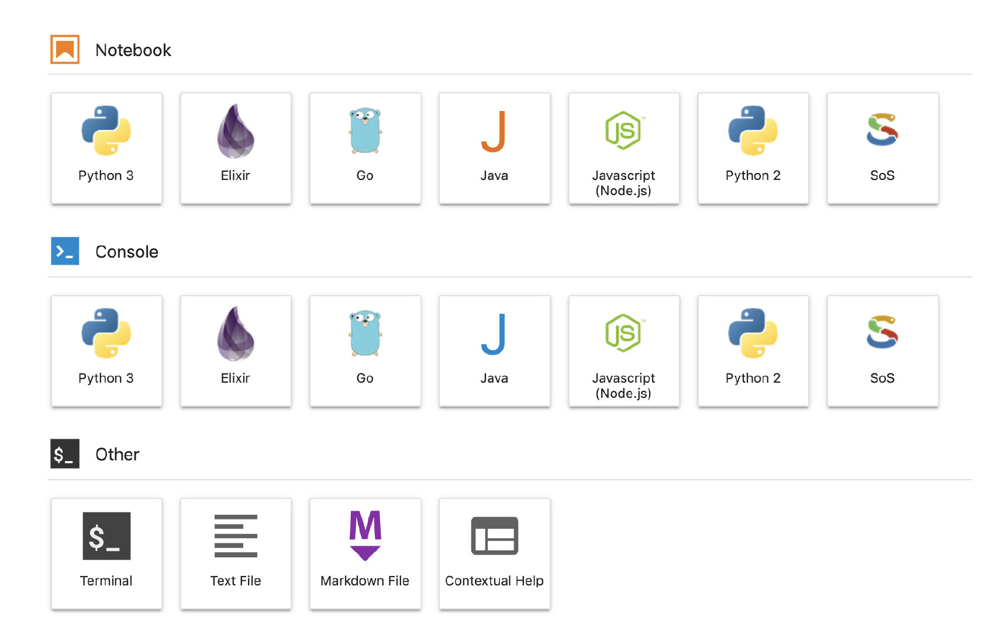

## 1 初心

19 年 5 月 25 日，笑来老师发布「自学是门手艺」一书不久，同时 Xue.Cn 内测。

之前在搞机器学习当调参侠的时候接触过 Jupyter Notebook，但当时仅仅觉得这是个好用的可运行 Python 代码的**笔记工具**。这次的机缘让我重新审视它。

然后发现 JupyterLab（Jupyter Notebook 进化版）在未来可能大有可为，因为它开始支持**多门语言**了！

↓多语言支持美滋滋↓

然后就打算用 JupyterLab 写一本关于**「比特币的技术教程」**，选择这个标的的目的也很简单：**1）之前写过一本「大狗精读区块链」，这次做个迭代；2）自己是高区块链的，从这个方向切入能加强自己对区块链的理解；3）对区块链未来的发展十分看好。**

于是乎开始动手。

##2 边学边写

首先研究了一番 JupyterLab，发现几个点很有意思，可以玩很多花活：

- 通过Ipynb.IFRAME 可以让笔记内嵌任意网页，这个特性导致具有丰富的想象空间——
  - 可以引用外部视频
  - 可以嵌入自己写的互动型网页
  - 可以嵌入网页型幻灯片
  - 可以嵌入刮刮卡型内容
  - ……
- 有手段将任意 Python 项目 Ipynb 化
- 可以将 Ipynb -> md -> 电子书

**Oh, that's Funny!**

然后就开始哔哩吧啦一顿写作，在这个过程里，对比特币系统的理解 **更加系统化** 了。

同时首次使用了 Github Project 去管理项目，很轻量，很不错。

9 月 15日，初稿写完了。

https://github.com/leeduckgo/bitcoin_elementary_course_based_on_jupyterlab/projects/1

## 3 迭代

这时发现可以做更多的事情，例如搞个学习区块链知识的网站：

Https://bitcoin.doge.university

在建站的过程里解锁🔓了如下技能：

- Gh-pages 的使用。过去看别人用 Gh-pages，这次自己尝试了一把；

- 用 GitBook 制作电子书。这是个老牌工具了，而且目前也不更新了。不过这种工具嘛……更不更新也无所谓，够用。不过在生成之后还有一些地方需要手动改代码，确实挺烦的……期待以后有更好的解决方案。（Vue-Press？）

  （GitBook 手机适配、悬浮目录、返回顶部等功能还是挺不错的）

  

- 通过 Issues 来写项目博客（记录项目信息）。这个方案有利有弊：利在于有不同颜色的标签🏷，还有接口能查到内容，而且方便看项目的人找到；弊在于和真正的 Issues 会有混淆。所以还是要依据实际情况进行取舍。

  

一个小细节：

- 习题模块本来打算用前端自己写的，后来觉得腾讯问卷不错，就直接用了~

建好后发现这个站不只是个用以学习的 DEMO，自己平时查查也挺方便的~

10 月 16 号，[「比特币极速入门指南」](https://xue.cn/hub/app/books/3)上线 [Xue.cn](https://xue.cn)

## 4 致谢

感谢 @杨小二 在前端问题上的指导；

感谢 @吃猫的鱼 制作像素风图标；

感谢 @霍炬 让书上线 Xue.cn；

感谢 @刘娟娟 在我之后调整细节问题时的帮助。

最后，感谢所有读者的捧场！